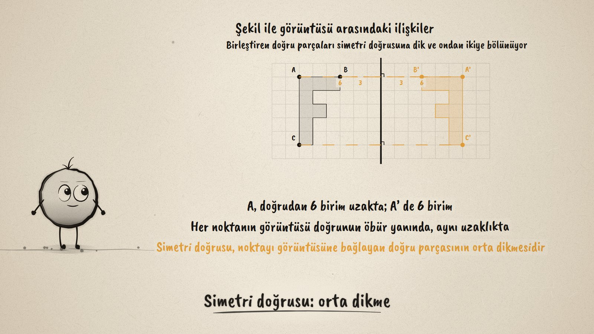
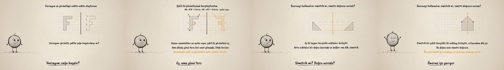

# Aynadaki Şekil · Reflections

**▶ Tarayıcıda izleyin / Watch in the browser:** https://hakanatas.github.io/aynadaki-sekil/ 
**⬇ MP4 + altyazılar / MP4 + subtitles:** [Releases](https://github.com/hakanatas/aynadaki-sekil/releases) 
**✎ Kullanılan istem / The prompt behind it:** [PROMPT.md](PROMPT.md) 
**🎞 Bütün filmler / All films:** [Nokta'nın Filmleri](https://hakanatas.github.io/nokta-filmleri/?sinif=7)

> **TR —** 7. sınıf matematik "Dönüşüm" temasındaki MAT.7.3.1 öğrenme çıktısı için hazırlanmış, tamamen JavaScript ile çizilen 92 saniyelik mürekkep animasyonu. Kareli kâğıtta F biçiminde bir şekil ve bir simetri doğrusu var. Varsayım: görüntü, şeklin sağa kaydırılmış hali mi? Kaydırınca F ters dönmüyor, varsayım tutmuyor. Görüntü nokta nokta oluşturuluyor: her köşe doğruya dik olarak karşıya, aynı uzaklığa taşınıyor. Şekil ile görüntüsü karşılaştırılıyor: kenarlar (3 ve 5 birim) ve açılar aynı, dönüş yönü ters. Önerme: bir noktayı görüntüsüne bağlayan doğru parçası simetri doğrusuna diktir ve ondan ikiye bölünür; simetri doğrusu bu parçanın orta dikmesidir. Son olarak önerme kullanılıyor: eş iki üçgenin simetrik olduğu gösteriliyor ve simetrik bir evin simetri doğrusu çiziliyor. Altyazılar Türkçe, İngilizce ya da ikisi birlikte seçilebilir.

A 92-second ink animation for **7th-grade maths**. Nokta, the ink character from [The Learning Ink](https://github.com/hakanatas/the-learning-ink), is the guide again. Every figure is a list of grid points (`FIG`, `T1`, `HOUSE` in `scenes/scene1.js`), and its reflection is computed by `refl`, which only changes the sign of x, so the image is exact and the guessed slide (`shift`) can be drawn next to it for comparison.

## Learning outcome

MEB, Türkiye Yüzyılı Maarif Modeli, Ortaokul Matematik, 7th grade, "Dönüşüm" theme:

**MAT.7.3.1. Şekillerin yansıma dönüşümü altındaki görüntülerinin oluşturulmasına dair çıkarım yapabilme**
- a) Şekillerin yansıma dönüşümleri altındaki görüntülerini oluşturmaya dair varsayımlarda bulunur.
- b) Şekillerin yansıma dönüşümü altındaki görüntülerini oluşturur.
- c) Varsayımlarını doğrulamaya yönelik karşılaştırmalar yapar.
- ç) Bir şekil ile yansıma dönüşümü altındaki görüntüsü arasındaki ilişkilere dair önermeler sunar.
- d) Önermenin verilen iki eş şeklin bir doğruya göre simetrik olup olmadığını belirlemeye ve simetrik bir şeklin simetri doğrusunu oluşturmaya yönelik katkısını değerlendirir.

## Scenes

| # | Time | Scene | What happens | Outcome |
|---|---|---|---|---|
| 1 | 0–10 s | Ayna | An F-shaped figure and a line: where is its image? | a |
| 2 | 10–28 s | Görüntü | The slide guess fails; the image is built corner by corner. | a, b |
| 3 | 28–46 s | Karşılaştır | Sides 3 and 5, same angles, reversed turning direction. | c |
| 4 | 46–64 s | İlişkiler | The joining segments are perpendicular to the line and halved by it. | ç |
| 5 | 64–80 s | Simetrik mi? | Two triangles are symmetric; the line of symmetry of a house. | d |
| 6 | 80–92 s | Aklında kalsın | Perpendicular, equal distance, congruent; the line is a perpendicular bisector. | a–d |

## Running it

- **Preview:** double-click `index.html` (it works offline).
- **MP4:** run `npm install` once, then `npm run export -- --format=horizontal --captions=tr`.
- **Subtitles and narration:** `npm run srt` writes `out/captions_*.srt` and `narration_notes.txt`.
- **Editing:**
  - Caption text, timings and narration notes: `captions.js`
  - Everything on screen is drawn by `LI.world(t)` in `scenes/scene1.js` (the grid, the figures, the mirror lines, the words); the other scenes only set the camera.
  - Nokta's poses: `src/draw/film.js`; layout for 16:9 and 9:16: `src/draw/kd.js`

It uses the same engine as The Learning Ink: `renderFrame(t)` as a pure function of time, seeded randomness, and frame-by-frame export.

## Lisans · License

**TR —** Bu film ve kodu [Creative Commons Atıf-GayriTicari 4.0 Uluslararası (CC BY-NC 4.0)](https://creativecommons.org/licenses/by-nc/4.0/deed.tr) lisansıyla paylaşılır. Ticari olmayan her amaçla (derste, okulda, eğitim materyalinde) kopyalayabilir, paylaşabilir ve değiştirebilirsiniz; ancak **kaynak göstermek zorunludur**: eser sahibinin adı ve bu deponun bağlantısı belirtilmeden kullanılamaz. Ticari kullanım (satış, ücretli ürün ya da yayın) için izin alınmalıdır.

**EN —** This film and its code are licensed under [Creative Commons Attribution-NonCommercial 4.0 International (CC BY-NC 4.0)](https://creativecommons.org/licenses/by-nc/4.0/). You may copy, share and adapt them for non-commercial purposes, but **attribution is required**: they may not be used without crediting the author and linking to this repository. Commercial use requires permission.

Atıf örneği / Required credit: *“Aynadaki Şekil”, Hakan Ataş, Nokta'nın Filmleri — https://github.com/hakanatas/aynadaki-sekil — CC BY-NC 4.0*
